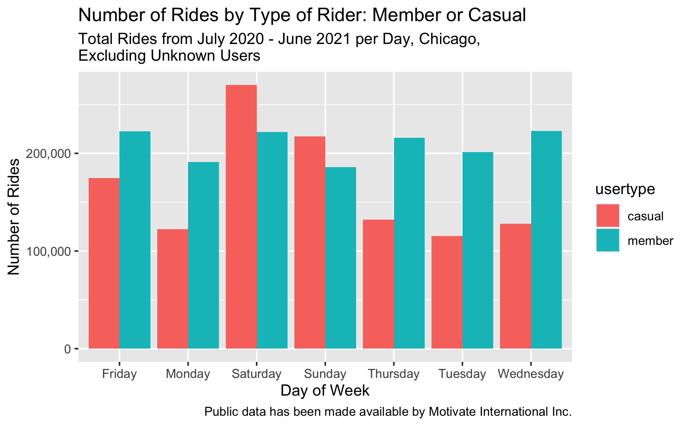
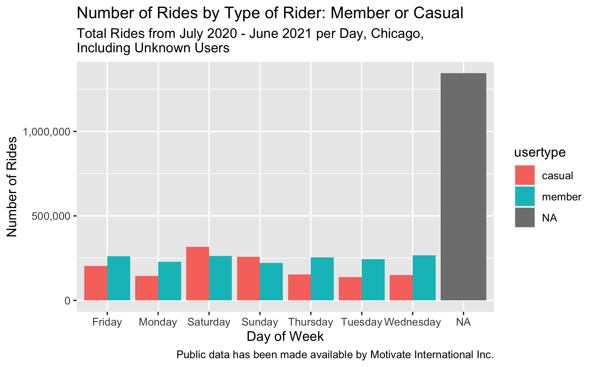
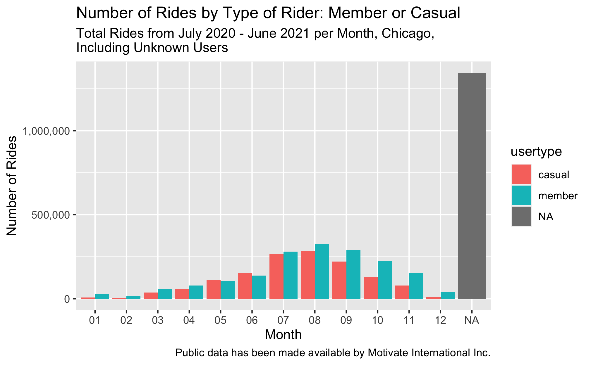
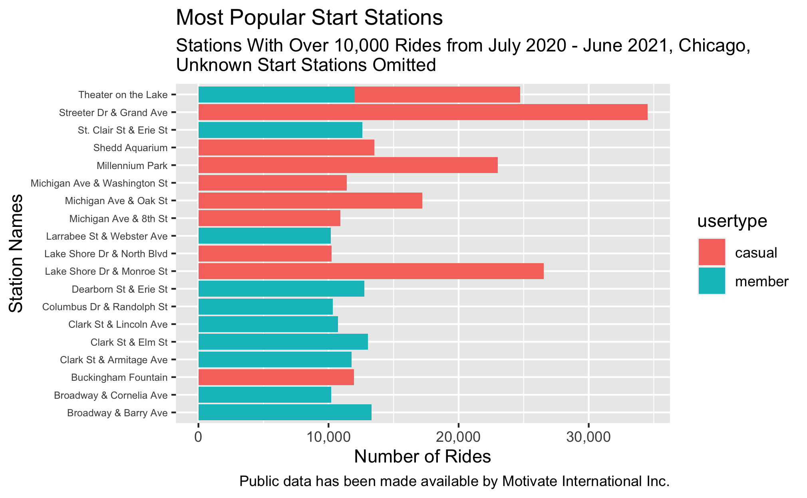
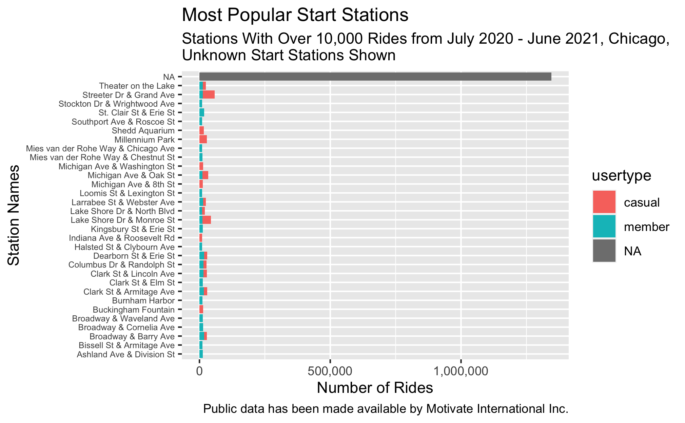
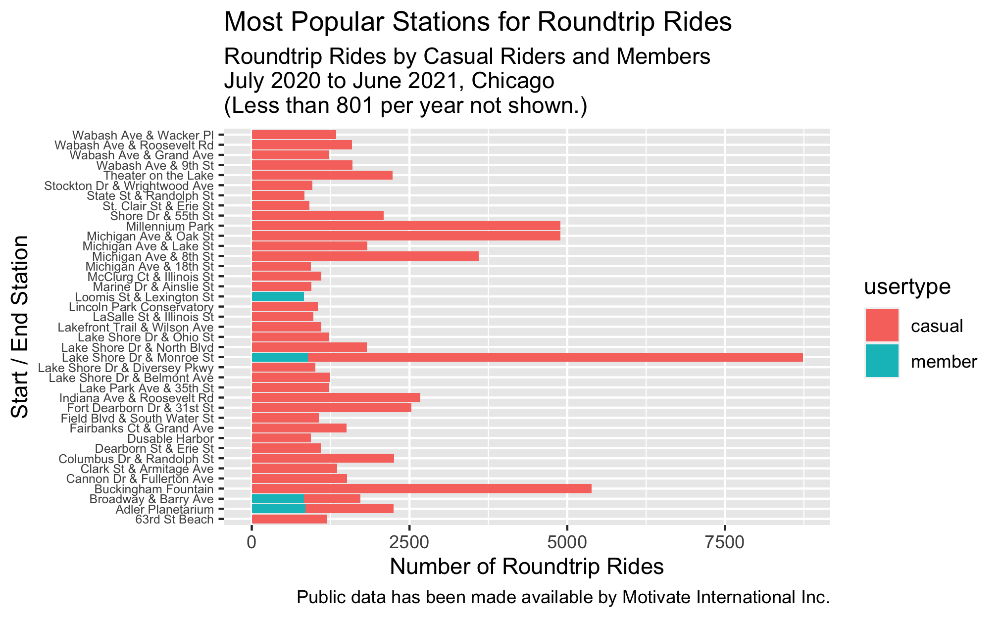

## Case Study: How Does Cyclistic Bike-Share Navigate Speedy Success?

**Goal**:

  Design marketing strategies that convert casual riders to annual members.

**Why**:

  Cyclistic’s finance analysts have concluded that annual members are much more profitable than casual riders. 

**How**:

  Help our marketing analytics team **better understand how annual members and casual riders differ (the scope of this document)**, why casual riders would buy Cyclistic annual memberships, and how digital media could affect marketing tactics. Key to this is analyzing the Cyclistic historical bike trip data to identify trends.

**About this case study**:

  - This is my capstone project for my [Google Analytics Professional Certificate](https://coursera.org/share/ca837b41716199898aa3b07a048cff41) and first portfolio piece for my job search. 

  - Cyclistic, the fictional company used for this analysis is on based on the Divvy case study ["Sophisticated, Clear, and Polished’: Divvy and Data Visualization" written by Kevin Hartman](https://artscience.blog/home/divvy-dataviz-case-study). A detailed R script was provided by him which I used with modifications.

  - After doing initial data familiarization and analysis in Excel using the most recent 12 months of historical data based on the [comprehensive case study instructions provided by Google](https://www.coursera.org/learn/google-data-analytics-capstone?specialization=google-data-analytics), (which included preliminary data organization, data cleaning and transformation, and data summarization with pivot tables using the mean of ride_length, max of ride_length, and the mode of day_of_week), I chose to continue my [final analysis and data visualizations in R](https://www.instagram.com/caroladdassi/). Please see this [changelog](https://www.instagram.com/caroladdassi/) for additional details.

**Data sources**:

  Although Cyclistic is a fictional company, the [public data](https://divvy-tripdata.s3.amazonaws.com/index.html) used has been made available by Motivate International Inc. under this [license](https://www.divvybikes.com/data-license-agreement). Divvy is a bike-share program of the Chicago Department of Transportation (CDOT).  Please note that data-privacy issues prohibit usage of riders’ personally identifiable information. This means that past purchases may not be connected to credit card numbers to determine if casual riders live in the bike-share company's service area or if they have purchased multiple single passes.

**Additional credits**:

  - Huge thank you's to Google and all of their wonderful instructors who created this super-beneficial program. Besides the incisive and engaging original content, they provided copious resources for deeper dives into all phases of the data analytics project life cycle.

  - Specifically for this capstone project, finding [KaptainTech's video](https://youtu.be/cpUVV8q7WNo) which shows how to measure distance in Excel using longitude and latitude coordinates was immensely helpful. (The distance is measured between points, not driving directions. Even so, it provided context for comparing miles traveled between casual riders and annual members.)

### So, how do annual members and casual riders use Cyclistic bikes differently?

>*Based on the available data, there is higher ridership of casual riders on Saturday and Sunday, while members outpace casuals on weekdays from July 2020 through June 2021.*

>*However, the data has an almost equal amount of unknown types of riders (1,344,783) as there are casual riders (1,364,323), while members (1,741,173 riders) make up the difference for a total of 4,458,406, after deleting 9,872 records with negative ride length. Knowing what types of riders these are could make a big difference in future marketing plans.*

>*As may be expected, the hotter months, July and August, show higher ridership of all users with members being slightly higher. From July until December as the total number of rides declines, casual riders show progressively less ridership than members, a trend that is mirrored in January through April when overall ridership increases as the weather gets warmer, with casual riders continuing to lag behind members in total rides.*

>*Casual riders’ average ride-time is significantly longer every day of the week for the 12 months.*

>*Casual riders dominate starting their rides at the two most popular stations to begin rides, Streeter Dr. & Grand Ave. and Lake Shore Dr. & Monroe St. It’s fairly even ridership for the rest of the most popular start stations between the two types of riders.*

>*Again we see there are many unknowns as far as which stations are most popular for the entire pool of riders.*

>*Casual riders by far take the most roundtrip rides, defined as the distance traveled as zero with a non-zero ride length. Lake Shore Dr. & Monroe St. stands out from the rest of the stations in this regard. Other stations near Lake Shore Dr., like Michigan Ave. & Lake St. and Michigan Ave. & Oak St., or tourist destinations near there, Millennium Park and Buckingham Fountain for example, also rank high for roundtrip usage.*

Recommendations: 

- Investigate ways to increase data completeness, especially with usertype, beginning, and ending stations. How is the data captured? Are there ways to do it that avoid manual input, if that is currently an aspect of how it’s captured?

- Casual riders by far outweigh members with the number of roundtrip rides taken. Connecting roundtrip ridership in the minds of casual riders with the benefits of membership could be very helpful.

- Include in a marketing plan benefits to casual riders to ride more on weekdays. For example, weekday discounts for casual riders that are cheaper than what they’re paying now, (but not as beneficial as memberships) could be an enticement.

- Lake Shore Dr. & Monroe St. station appears to be popular in multiple ways with all riders and especially with casual riders. Targeting casual riders at that station with membership enticements could be an effective way to reach many casual riders in one place. Streeter Dr. & Grand Ave. is also quite popular with casual riders which would make it a prime location to reach them.

- Members overall take more rides on all days except weekend days and lead in the number of rides in all months except April, May, and June, which are close for both types of riders. Casual riders' average ride time is significantly higher than members' average ride time. Based on the specs for the case study, members are more profitable than casual riders. Knowing the membership price, cost of individual rides, and the information as to what makes members more profitable since they use the service more than casual riders do, would be helpful in further understanding how these two types of riders differ.

