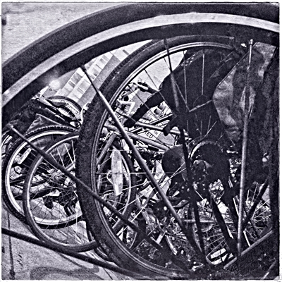
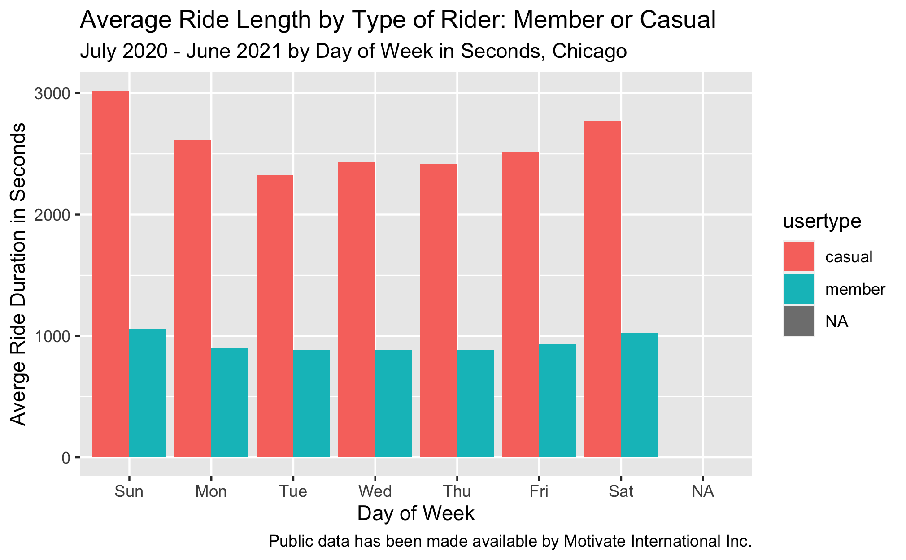
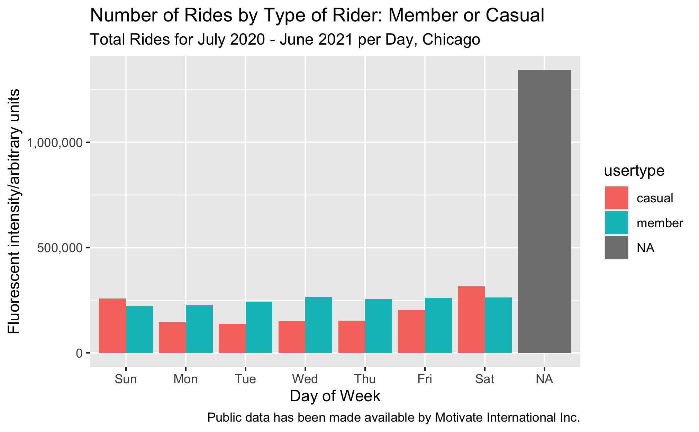

## Case Study: How Does Cyclistic Bike-Share Navigate Speedy Success?

**Goal**:

  Design marketing strategies that convert casual riders to annual members.

**Why**:

  Cyclistic’s finance analysts have concluded that annual members are much more profitable than casual riders. 

**How**:

  Help our marketing analytics team **better understand how annual members and casual riders differ (the scope of this document)**, why casual riders would buy Cyclistic annual memberships, and how digital media could affect marketing tactics. Key to this is analyzing the Cyclistic historical bike trip data to identify trends.

**About this case study**:

  - This is my capstone project for my [Google Analytics Professional Certificate](https://coursera.org/share/ca837b41716199898aa3b07a048cff41) and first portfolio piece for my job search. 

  - Cyclistic, the fictional company used for this analysis is on based on the Divvy case study ["Sophisticated, Clear, and Polished’: Divvy and Data Visualization" written by Kevin Hartman](https://artscience.blog/home/divvy-dataviz-case-study). A detailed R script was provided by him which I used with modifications.

  - After doing initial data familiarization and analysis in Excel using the most recent 12 months of historical data based on the [comprehensive case study instructions provided by Google](https://www.coursera.org/learn/google-data-analytics-capstone?specialization=google-data-analytics), (which included preliminary data organization, data cleaning and transformation, and data summarization with pivot tables using the mean of ride_length, max of ride_length, and the mode of day_of_week), I chose to continue my [final analysis and data visualizations in R](https://clever-poitras-02da34.netlify.app/about/). Please see this [changelog](/Users/caroladdassi/RProjects/cwaportfolio/content/talk/2021-08-10-changelog-for-cylistics-project/_index.md) for specific details.

**Data sources**:

  Although Cyclistic is a fictional company, the [public data](https://divvy-tripdata.s3.amazonaws.com/index.html) used has been made available by Motivate International Inc. under this [license](https://www.divvybikes.com/data-license-agreement). Divvy is a bike-share program of the Chicago Department of Transportation (CDOT).  Please note that data-privacy issues prohibit usage of riders’ personally identifiable information. This means that past purchases may not be connected to credit card numbers to determine if casual riders live in the bike-share company's service area or if they have purchased multiple single passes.

**Additional credits**:

  - Huge thank you's to Google and all of their wonderful instructors who created this super-beneficial program. Besides the incisive and engaging original content, they provided copious resources for deeper dives into all phases of the data analytics project life cycle.

  - Specifically for this capstone project, finding [KaptainTech's video](https://youtu.be/cpUVV8q7WNo) which shows how to measure distance in Excel using longitude and latitude coordinates was immensely helpful. (The distance is measured between points, not driving directions. Even so, it provided context for comparing miles traveled between casual riders and annual members.)

### So, how do annual members and casual riders use Cyclistic bikes differently?

