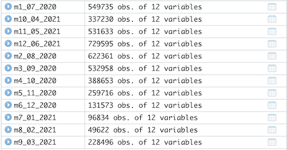
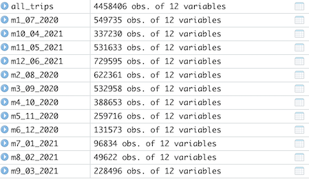

## Changelog for Cyclistic Bike-Share Case Study

### New, 08/06/2021, v1.0

  - 12 files of the most recent [monthly historical data (July 2020 - June 2021)](https://clever-poitras-02da34.netlify.app/talk/) were imported and unzipped into .csv files, opened in Excel, and converted to .xlsx files. 
  
  - Copies of the 12 files were kept at each stage: zipped, .csv., and .xlsx, until the end of the project and it's determined they are no longer necessary. A working copy of 12 .xlsx files are used for analysis. 
  
  - Below are the number of rows (excluding headers) for each original .csv:
    - 2020_07 - 551,480
    - 2020_08 - 622,361
    - 2020_09 - 532,958
    - 2020_10 - 388, 653
    - 2020_11 - 259,716
    - 2020_12 - 131,573
    - 2021_01 -  96,834
    - 2021_02 -  49,622
    - 2021_03 - 228,496
    - 2021_04 - 337,230
    - 2021_05 - 531,633
    - 2021_06 - 729,595 
    
### Changes (in Excel), 08/07/2021, v1.0
    
  - All files were checked for duplicates. None were found.
  
  - All data in all files were aligned left in columns, including headings.
  
  - Columns started_at and ended_at were reformatted as HH:MM:SS using Format > Cells > Time > 37:30:55 for the first month, 2020_07. (The other 11 files were left in m/d/yy h:mm format for those two columns. All files will be taken into R for final processing. As this is also a learning experiment, wanted to see how data formats interact while using multiple files with thousands of rows.)
  
  - 3 columns were added in all files: ride_length (length of each ride), day_of_week (calculating the day of the week that each ride started), and distance_traveled_mi (from latitude and longitude as point to point, not driving routes).

  - The calculated data in the distance_traveled_mi column cells in all files were copied and pasted as a values prior to deleting 4 latitude and longitude columns: start_lat, start_lng, end_lat, and end_lng.
  
### Changes (in Excel), 08/08/2021, v1.0
  
  - 2020_07 has started_at and ended_at columns with cell format of 37:30:55 and those same columns in the other 11 files were left as is. Where ended_at is less than started_at, the negative column data in ride_length appears as "##############" in 2020_07 and as negative numbers in the other 11 files where the column formats were not changed. I deleted the rows where ride length is negative here and left the ride_length fields with negative numbers in the other 11 files in them for deletion later in R. 1,745 rows were deleted in 2020_07 leaving the current total of rows excluding the header as **549,735**.
  
  - Replaced all #NUM! errors in all files with zero where start_lat and start_lng were the same as end_lat and end_lng where customers began and ended their rides at the same station. The number on instances changed in each file are:
 
    - 2020_07: 744
    - 2020_08: 801
    - 2020_09: 713
    - 2020_10: 724
    - 2020_11: 629
    - 2020_12: 342
    - 2021_01: 216
    - 2021_02: 142
    - 2021_03: 541
    - 2021_04: 821 
    - 2021_05: 1486
    - 2021_06: 1554
  

### Changes (in R), 08/8/2021, v1.0  
  
  - Read in 12 monthly .xlsx files that were transformed in Excel.
  
  - The number of observations correctly corresponds to the current amount of rows per file after data cleaning in Excel. (Please note they are not listed in sequential order by month.):
  

  - Renamed 9 original columns in all files (after checking that all column heads are consistently named among all the files) to align with the proposed source file changes going forward in Q1 2020 by the real-life Divvy program as stated in the case study packet. (As it happens, the original file names are still in use on the more recent Divvy files I'm using. I changed them anyway to be consistent with ["Sophisticated, Clear, and Polished’: Divvy and Data Visualization" written by Kevin Hartman](https://artscience.blog/home/divvy-dataviz-case-study) that this fictional Cyclistic study is based on.)
  
  - Converted ride_id and rideable_type to character in all files so that they can stack correctly.
  
  - Converted ride_length to double in all files so that they can stack correctly.
  
  - Converted from_station_id and to_station_id in all files to double so that they can stack correctly.
  
  - Stacked individual month's data frames into one big data frame comprising 4,458,406 rows (excluding the header) which matches with the count of the 12 individual files.

  - Added columns that list the date, month, day, and year of each ride which will allow us to aggregate ride data for each month, day, or year. (I'd previously added a day_of_week column in Excel, as noted earlier.)
  
  - Added an additional ride_length_r field as a comparison to ride_length created in Excel.
  
  - Converted ride_length_r from Factor to numeric so we can run calculations on the data.
  
  - Deleted rides where tripduration shows up as negative in the remainder of the ride_length fields and created a new version of the dataframe (v2) since data is being removed. 
  
  - Deleted rides where tripduration shows up as negative in the ride_length_r fields and created a new version of the dataframe (v3) since data is being removed.
  
  - Created a summary .csv file.
  
  - Created a .csv of the entire dataframe for archiving.
  
 
